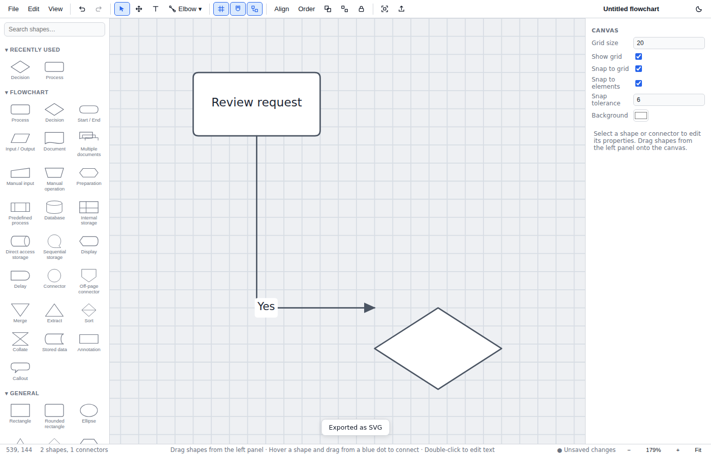

# FlowShark User Guide

FlowShark is a flowchart editor for Windows (ARM64 and x64) that also runs in
a modern browser. This guide covers everything you need to build, style, and
export professional flowcharts.

## 1. The workspace

- **Toolbar (top)** — File/Edit/View menus, undo/redo, tools, snapping
  toggles, arrange menus, group/lock, export, document title, dark mode.
- **Shape panel (left)** — searchable shape library: Flowchart, General,
  Connector and Container categories plus your recently used shapes.
- **Canvas (center)** — the diagram itself.
- **Inspector (right)** — properties for whatever is selected (canvas
  settings when nothing is selected).
- **Status bar (bottom)** — cursor position, selection/element counts,
  unsaved indicator, zoom controls.

## 2. Creating your first flowchart

1. **Add a shape.** Drag any shape from the left panel onto the canvas — or
   click it once and then click the canvas to place it. Double-clicking an
   empty spot on the canvas quick-creates a Process shape.
2. **Label it.** Double-click the shape (or press **F2**) and type. **Enter**
   commits, **Shift+Enter** adds a line break, **Esc** cancels.
3. **Connect shapes.** Hover over an (unselected) shape — blue connection
   dots appear on its edges. Drag from a dot to another shape and release.
   Drop on a specific dot to pin the connector to that point, or anywhere on
   the shape body to let it float to the nearest edge automatically.
4. **Label the flow.** Double-click a connector to add a label ("Yes",
   "No", "Approved"…). Labels stay attached as the connector reroutes.
5. **Save.** **Ctrl+S** writes a `.flowshark` project file you can reopen and
   keep editing.

> Tip: start even faster with **File → New from template…** — ten editable
> starter diagrams are included.

## 3. Selecting and arranging

- **Click** selects; **Shift+click** (or Ctrl+click) adds/removes from the
  selection; dragging on empty canvas draws a **marquee**; **Ctrl+A** selects
  everything. Clicking a grouped element selects the whole group.
- **Move** by dragging (hold **Alt** to bypass snapping). **Arrow keys**
  nudge 1 px; **Shift+arrows** nudge 10 px.
- **Resize** a selected shape with its eight handles; hold **Shift** to keep
  proportions.
- **Rotate** via the Rotation field in the inspector.
- **Align / distribute / match size** — select 2+ shapes, then use the
  toolbar **Align** menu or the Arrange section in the inspector.
- **Snapping** — toggle grid visibility, snap-to-grid, and snap-to-element in
  the toolbar (or View menu). Red guide lines appear when edges/centers
  align; grid size and snap tolerance are adjustable in the inspector when
  nothing is selected.
- **Group** with **Ctrl+G**, ungroup with **Ctrl+Shift+G**.
- **Ordering** — Order menu or **Ctrl+]** / **Ctrl+[** (Shift for
  front/back).
- **Lock** (🔒 toolbar button or inspector) prevents moving/deleting;
  **Hide** dims an element and excludes it from exports.

## 4. Working with connectors

- **Types** — straight, elbow (rounded corners), step (square corners),
  curved, freeform. Pick the type from the connector dropdown in the toolbar
  before drawing, or change it later in the inspector.
- **Connector tool** — press **C** (or use the toolbar dropdown), then drag
  from any shape to another.
- **Rerouting** — connectors recalculate automatically when shapes move.
- **Bend points** — select a connector; drag the small hollow dots at
  segment midpoints to add a bend; drag existing (diamond) bend points to
  move them; **Alt+click** a bend point to remove it; "Clear bend points" in
  the inspector resets the route.
- **Reconnect** — select a connector and drag either endpoint to a different
  shape or drop it on empty canvas for a free end.
- **Styling** — line color, width, solid/dashed/dotted, opacity, and start/
  end caps (none, arrow, open arrow, filled arrow, diamond, circle, square,
  bar — filled variants included) in the inspector. "Reverse direction"
  swaps the arrow.
- **Labels** — double-click the line to add one where you clicked, or use
  "+ Add label" in the inspector. Each label has position (% along the
  line), perpendicular offset, and a background fill so it stays readable.

## 5. Text

- Any shape can hold text (double-click / F2). Standalone text: press **T**
  and click the canvas.
- Inspector controls: font family, size, color, **B**/*I*/U̲, horizontal
  alignment (left/center/right), vertical alignment (top/middle/bottom),
  padding, and line spacing. Text wraps automatically.

## 6. Styling shapes

With shapes selected, the inspector offers fill color and opacity, border
color/thickness/style (solid/dashed/dotted), and corner radius. Style
several shapes at once by multi-selecting. To reuse a look: **Ctrl+Shift+C**
copies the style of the selected element, **Ctrl+Shift+V** applies it to
another selection.

## 7. View controls

- **Zoom** — Ctrl+mouse wheel (or pinch), **Ctrl +** / **Ctrl −**, the ± in
  the status bar, **Ctrl+1** for 100%.
- **Fit** — **Ctrl+0** fits the whole diagram; **Ctrl+2** fits the selection.
- **Pan** — mouse wheel scrolls, Shift+wheel scrolls horizontally, middle
  mouse button drags, hold **Space** and drag, or use the pan tool (**H**).
- **Dark mode** — moon button (top right) or View menu; your preference is
  remembered.

## 8. Files, autosave, and recovery

- **Ctrl+N** new, **Ctrl+O** open, **Ctrl+S** save, **Ctrl+Shift+S** save as.
  Projects are JSON `.flowshark` files with a versioned schema — newer
  FlowShark versions always open older files.
- **Recent files** appear in the File menu (desktop app). FlowShark's
  standing permission covers your **Documents** folder. A project you opened
  from somewhere else works for the rest of that session, but after you
  restart the app FlowShark will ask you to pick it again from the file
  dialog — choose the file and it opens normally; decline and the entry is
  removed. Keeping projects under Documents avoids this.
- **Autosave** snapshots your work every 15 seconds. If the app closes
  unexpectedly, a **Restore** banner offers the recovered diagram on next
  launch. A restored diagram counts as unsaved until you save it, even if
  you undo your way back past everything you did after restoring.
- You'll be warned before discarding unsaved changes (new/open/close).
  Grid, snapping and background changes count as changes: they are undoable
  and part of the saved document, like anything else you edit.
- **In a browser** (rather than the desktop app), saving depends on the
  engine. Chromium-based browsers can save over the same file; Firefox and
  Safari download a new copy each time, and FlowShark says "Downloaded…"
  rather than "Saved…" so you can tell the difference.
- FlowShark refuses to open `.flowshark` files larger than 32 MB, and
  repairs (rather than trusts) files with corrupt structure — duplicate
  ids, overlapping groups or out-of-range values are fixed on load.

## 9. Import and export

**Export** (Ctrl+E or File → Export…):

- Formats: **PNG**, **SVG**, **PDF**, plus JPEG and WebP.
- Options: entire diagram or selected objects only, scale 1×–4×, margin,
  transparent background (PNG/SVG/WebP), include grid.
- Quick one-click exports: File → Export PNG / SVG / PDF.
- **Copy as image** / **Copy as SVG** put the diagram on the clipboard for
  pasting into documents, chats, and design tools.

**Import**:

- File → Import image… places PNG, JPEG, and WebP files as image objects.
- Paste an image from the clipboard directly onto the canvas (**Ctrl+V**) —
  PNG, JPEG, GIF, WebP, and BMP are accepted.
- **SVG files cannot be imported.** SVG can contain scripts and external
  references, and FlowShark does not yet bundle a sanitizer that can make
  arbitrary SVG safe to embed, so it is excluded from both the import
  dialog and clipboard paste (see OPENQUESTIONS.md Q18). SVG *export* is
  unaffected.

## 10. Keyboard shortcuts

| Shortcut | Action |
| --- | --- |
| Ctrl+N / Ctrl+O | New / Open |
| Ctrl+S / Ctrl+Shift+S | Save / Save As |
| Ctrl+E | Export dialog |
| Ctrl+Z / Ctrl+Y or Ctrl+Shift+Z | Undo / Redo |
| Ctrl+X / Ctrl+C / Ctrl+V | Cut / Copy / Paste |
| Ctrl+D | Duplicate |
| Ctrl+Shift+C / Ctrl+Shift+V | Copy style / Paste style |
| Delete or Backspace | Delete selection |
| Ctrl+A / Esc | Select all / Deselect |
| Ctrl+G / Ctrl+Shift+G | Group / Ungroup |
| Ctrl+] / Ctrl+[ | Bring forward / Send backward |
| Ctrl+Shift+] / Ctrl+Shift+[ | Bring to front / Send to back |
| Ctrl++ / Ctrl+− / Ctrl+1 | Zoom in / out / 100% |
| Ctrl+0 / Ctrl+2 | Fit diagram / Fit selection |
| Ctrl+' | Toggle grid |
| Arrows / Shift+Arrows | Nudge 1 px / 10 px |
| V / H / T / C | Select / Pan / Text / Connector tool |
| F2 | Edit text of selected shape |
| Space (hold) | Temporary pan |
| Alt (while dragging) | Disable snapping |
| Alt+click bend point | Remove bend point |
| Shift (while resizing) | Keep aspect ratio |
| Tab / Shift+Tab (canvas focused) | Select the next / previous object |
| Enter (canvas focused) | Edit the selected shape's text |

### Working without a mouse

Click the canvas once (or Tab to it from the toolbar), then use **Tab** and
**Shift+Tab** to step through every shape and connector in the diagram in
front-to-back order. Each one is selected as you reach it and announced to
screen readers. From there **Enter** edits its text, the **arrow keys** move
it, **Delete** removes it, and every command in the table above applies to
the selection. **Esc** deselects and returns you to the normal Tab order.

## 11. Tips

- **Swimlanes**: drop a Swimlane container per team, **lock** the lanes
  (🔒), then build the flow on top — the swimlane template shows the
  pattern.
- **Consistent diagrams**: build one styled shape, then Ctrl+Shift+C /
  Ctrl+Shift+V the style onto the rest; use Align + Distribute + Make same
  size for a tidy grid.
- **Presentation-ready exports**: export PNG at 2×–3× scale with a margin of
  20–40 px; use transparent background to drop diagrams onto slides.
