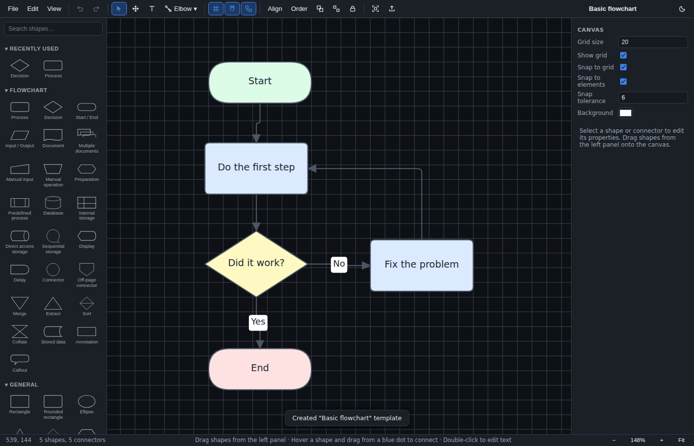

# FlowShark 🦈

**A fast, native-feeling flowchart application for Windows on ARM and macOS.**

FlowShark is a lightweight but comprehensive diagram editor for building
professional flowcharts — business process maps, decision trees, system flows,
swimlane diagrams, and more. It is optimized for Windows 11 on ARM (with x64
and macOS builds from the same codebase) and runs in any modern browser
during development.



## Features

- **Complete flowchart shape library** — process, decision, terminator,
  input/output, document(s), manual input/operation, preparation, predefined
  process, database, internal/direct/sequential storage, display, delay,
  connectors, off-page connector, merge, extract, sort, collate, stored data,
  annotation, callout, swimlane and phase containers — plus general shapes
  (rectangle, ellipse, triangle, diamond, hexagon, cylinder, cloud, star,
  text box, image and icon placeholders).
- **Rich connectors** — straight, elbow, step, curved, and freeform routing;
  dynamic rerouting when shapes move; fixed or floating attachment points;
  eleven endpoint styles (arrows, diamonds, circles, squares, bar); dashed,
  dotted, and thick/thin lines; movable bend points; draggable text labels
  with background fill.
- **Text everywhere** — double-click to edit text in any shape, on any
  connector, or as standalone text boxes; font family/size/weight/style,
  color, alignment (horizontal + vertical), wrapping, padding, line spacing.
- **Professional layout tools** — snap-to-grid, snap-to-element with live
  alignment guides, align (left/center/right/top/middle/bottom), distribute
  (horizontal/vertical), match size, group/ungroup, z-ordering, lock/hide.
- **Solid editing** — 200-step undo/redo, cut/copy/paste/duplicate,
  copy/paste style, marquee and multi-select, keyboard nudging, full
  keyboard-shortcut set.
- **Files and export** — versioned JSON-based `.flowshark` project format
  with validation and forward migration; export to **PNG, SVG, PDF** (plus
  JPEG/WebP), scale/margin/transparency/grid options, export selection only,
  copy as image or SVG to clipboard; autosave with crash recovery; recent
  files.
- **Starter templates** — basic flowchart, decision tree, process map,
  swimlane, software logic, customer journey, approval workflow, incident
  response, sales funnel, project workflow.
- **Polish** — dark mode, zoom/pan/fit, infinite canvas, touch-friendly
  pointer events, accessible labeled controls.

See [INSTRUCTIONS.md](INSTRUCTIONS.md) for the full user guide, and
[PROJECTBRIEF.md](PROJECTBRIEF.md) for the original product brief.

## Technology

FlowShark implements **Option C** from the project brief: a web-based desktop
shell chosen for development speed, small footprint, and first-class SVG
export fidelity.

| Layer | Technology |
| --- | --- |
| Desktop shell | [Tauri 2](https://tauri.app) + WebView2 (native ARM64 on Windows on ARM) / WKWebView (macOS) |
| UI / editor | TypeScript, no framework — direct DOM + SVG rendering engine |
| Rendering | SVG scene graph; the same renderer drives the screen, SVG/PNG/PDF export |
| PDF export | jsPDF + svg2pdf.js (lazy-loaded) |
| Build | Vite 6, Rust (stable) for the shell |
| Tests | Vitest unit tests + Playwright end-to-end smoke test |

Everything in the document model is plain JSON; rendering, model, UI, and
export are separate modules (see `src/model`, `src/core`, `src/shapes`,
`src/connectors`, `src/canvas`, `src/ui`, `src/io`).

## Installing FlowShark (non-developers)

If you just want to run FlowShark rather than work on its code, see
**[INSTALLATION.md](INSTALLATION.md)** — a step-by-step guide that assumes
no prior developer tools are installed, written for Windows on ARM, with a
dedicated section for macOS.

## Getting started (development)

Prerequisites: Node.js ≥ 20. For desktop builds: Rust (stable) and the
[Tauri prerequisites](https://tauri.app/start/prerequisites/) for your OS.

```bash
npm install
npm run dev          # browser dev server at http://localhost:1420
npm test             # unit tests (Vitest)
npm run typecheck    # TypeScript
npm run build        # typecheck + production bundle to dist/
node scripts/smoke.mjs   # end-to-end smoke test in headless Chromium (build first)
```

The full editor runs in a plain browser during development — file dialogs
fall back to the File System Access API or downloads.

## Building for Windows on ARM

On a Windows ARM machine (or the `windows-11-arm` GitHub runner):

```powershell
rustup target add aarch64-pc-windows-msvc
npm ci
npx tauri build --target aarch64-pc-windows-msvc
```

The NSIS installer lands in
`src-tauri/target/aarch64-pc-windows-msvc/release/bundle/nsis/`.
For x64: substitute `x86_64-pc-windows-msvc`.

## Building for macOS

On a Mac (Apple Silicon or Intel) with Xcode Command Line Tools installed
(`xcode-select --install`):

```bash
npm ci
npx tauri build                 # native .app + .dmg for this Mac's architecture
```

For a universal binary (runs natively on both Apple Silicon and Intel):

```bash
rustup target add aarch64-apple-darwin x86_64-apple-darwin
npx tauri build --target universal-apple-darwin
```

The `.app` bundle and `.dmg` disk image land in
`src-tauri/target/[universal-apple-darwin/]release/bundle/{macos,dmg}/`.
Builds are currently unsigned/un-notarized — see
[INSTALLATION.md](INSTALLATION.md#installing-on-macos) for how to open an
unsigned build past Gatekeeper.

CI (`.github/workflows/ci.yml`) runs typecheck, unit tests, and the Chromium
smoke test on every push/PR, and builds Windows ARM64 + x64 installers plus a
universal macOS disk image on pushes to `main`, tags, and manual dispatch.
Tagging `v*` attaches the installers to a draft GitHub release.

## Project documents

| File | Purpose |
| --- | --- |
| [PROJECTBRIEF.md](PROJECTBRIEF.md) | The original product brief (verbatim) + version-management appendix |
| [INSTALLATION.md](INSTALLATION.md) | Step-by-step install guide, assuming no prerequisites |
| [INSTRUCTIONS.md](INSTRUCTIONS.md) | User guide: how to use the application |
| [CHANGELOG.md](CHANGELOG.md) | Version history (Keep a Changelog format) |
| [OPENQUESTIONS.md](OPENQUESTIONS.md) | Open and resolved questions/decisions |
| [VERSIONING.md](VERSIONING.md) | How versions, releases, and the file-format schema are managed |
| [CODEX-REVIEW.md](CODEX-REVIEW.md) | Independent quality/security audit |
| [CODEX-REVIEW-RESPONSE.md](CODEX-REVIEW-RESPONSE.md) | Verification of and response to that audit |

## Version management (summary)

- App versions follow **SemVer** (`MAJOR.MINOR.PATCH`), kept in sync across
  `package.json`, `src-tauri/tauri.conf.json`, and `src-tauri/Cargo.toml`.
- The `.flowshark` file format has its own integer **schema version** with
  forward migrations on load.
- All notable changes go to **CHANGELOG.md** under `[Unreleased]` first.
- Releases are cut by tagging `vX.Y.Z`; CI produces the Windows installers
  and the macOS disk image.

Full details and step-by-step release instructions: [VERSIONING.md](VERSIONING.md).

## License

No license has been chosen yet — see OPENQUESTIONS.md.
